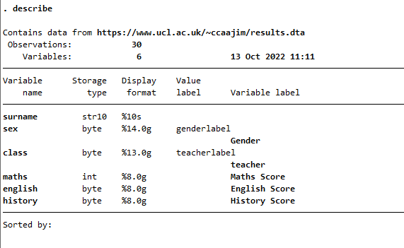

---
output:
  word_document: default
  html_document: default
---
# Some R use basics

## Folders

I assume that you have a folder structure something like

    Project Folder
    ├── raw_data
    ├── scripts
    │   ├── cleanmydata.R
    │   └── modelmydata.R
    ├── documentation
    │   ├── PDFs
    │   └── Word_docs
    └──graphs

(though you probably don't have scripts named `cleanmydata.R` and `modelmydata.R`, those are just examples). Of course, other folder set-ups are possible, so be aware of your own as you follow the rest of this guide. The path to my main project folder,for example, is

`c:\users\jt\Documents\Projects\RWrangling\`

## Exercise

If you do not have a folder for your project (including for this training series project!), create one now with sub folders as above. You do not need to create the two do files in the scripts folder. You can do this in R. First type

    getwd()

and then hit `enter`. Check the result and make sure that it shows the directory where you want to store your projects. To create the structure, you will find it easier right now using your computer's graphical user interface, but in case you want to do it in R, type the following R commands on the console (the command window), following each by return (replace ProjectName with a suitable name for your project)

```
dir.create('ProjectName')
setwd('ProjectName')
dir.create('raw_data')
dir.create('scripts')
dir.create('documentation')
dir.create('graphs')
dir.create('PDFs')
dir.create('Word_docs')
setwd('..')
getwd()
```           

Check that you end up back in your new project folder.

## Exercise

Using your operating systems file explorer, check the folder structure you just created for your project. If it isn't what you expect, correct it.

## Common File types

You will commonly encounter three types of file specific to R

-   The .Rda or Rdata file which are R's proprietary data formats;
-   The .R file which is R's scripting file type;
-   The .RMd file which is the file type of R report files (ie literate programs).

# The R file

R files are R's scripts. Simple programs made of text files of R commands.

You can create a new do file editing session from the **file** menu in RStudio.

Clear everything to make sure there's nothing leftover in our environment

    rm(list = ls())

## Initialising your script

In a new data wrangling script you should

-   start a log;
-   make sure you are in the correct project directory;
-   clear working memory.

So to start this process, in your new do file add these lines:

    capture log close
    log using "MainProjectName $S_DATE.log", append

and

    capture cmdlog close
    cmdlog using "CommandsProjectName $S_DATE.log", append

The first will log all commands and results window ouput (ie not graphs) the second will log commands only and not output. As you gain more experience you will probably choose to use on ly one of these logs.

The commands use a R system variable `$S_DATE` to insert today's date into the file name of your logs. This makes tracking your work easier.

## Exercise

Using your internet searching powers, find out why we wrote

    capture log close

at the start of the script, rather than just `log close`.

### Solution

[You will find an explanation here](http://people.umass.edu/pubp608/logsandscripts.txt#:~:text=The%20command%20%60%60capture%20log,no%20log%20open%20to%20close.).

## Which directory?

Next you should make sure you are in the correct directory.

To check which directory you are currently in type

    pwd

on the R console.

## Change to your data directory

Change directory to the folder that will hold your project's raw data files (that is data that you have not processed or transformed). Normally, for a data wrangling script, this will be the `raw_data` directory for the project and you change to that directory by typing a line like

    cd c:\users\jt\Documents\Projects\RWrangling\raw_data\

(you must alter this to point at **your** folder). When you write code to read a raw data file, you will want to make sure that it is read into this directory.

## Exercise

Close the log file or log files you have created and outside of R find the files and view the content.

# Dataset

We're using a dataset of examination results from thirty school students for demonstration and practice. For some more complicated exercises (at about the halfway mark and at the end), we will use a data set of medical trial results.

These data are in either R or Excel format. Each case or observation is a row with variables in columns[^03-basic_operations-1].

[^03-basic_operations-1]: Or almost, this data is in **wide** rather then **long** format, so it is not strictly tidy.

The exam data look something like this:

| surname   | sex | class | maths | english | history |
|:----------|----:|------:|------:|--------:|--------:|
| ADAMS     |   2 |     1 |    55 |      63 |      65 |
| ALI       |   2 |     1 |    52 |      46 |      35 |
| BAGAL     |   1 |     3 |    51 |      58 |      55 |
| BENJAMIN  |   1 |     2 |    59 |      70 |      68 |
| BLAKEMORE |   2 |     2 |    56 |      38 |      40 |

The R `use` command reads in data from R format files. Read the main data file by adding this command to your do file:

    use https://www.ucl.ac.uk/~ccaajim/results

When you first read a datafile, you should always

-   `describe` the data;
-   check the `codebook`.

You can do this for the complete set of variables for simple cases, but you may wish to be selective when you have a lot of variables.

## Data Types

The examination data is quite simple. In your do file add

    describe
    codebook

And run the do file. This first command produces



## Interpretation of `describe` output

This output shows first how many observations there are in your data and how many variables. The table that follows includes some detail about each variable:

### Storage type

There are two basic data types in R: *numeric* and *string* data. String data has two subtypes: strL (L for long) variables can store phenominal amounts of character data (2 billion) and str# (where \# is a number) which a limit on length of 2045 characters. Numeric data is of one of five types:

| type   | precision | range                            |
|:-------|:----------|:---------------------------------|
| byte   | integer   | -127 to 100                      |
| int    | integer   | -32,767 and 32,740               |
| long   | integer   | -2,147,483,647 and 2,147,483,620 |
| float  | real      | 8 digits of accuracy             |
| double | real      | 16 digits of accuracy            |

### Format types

These are associated with variable types - each has a default, which determines how values are displayed, so that regardless of the precision of the type, the number of decimal places and the width in number of characters to be displayed can be fixed. So a format type `%9.0g` is a left justified number of maximum 9 characters in width and with specific decimal precision (although in this case zero means 'just as many as can be displayed for this width').

## Interpretation of codebook

The output of `codebook` shows you the data type of the variables; the range and the numeric unit of measure; the number of unique values in the data; the number of values missing; the mean value for continuous variables; the standard deviation; the percentile values for the 10%, 25%, 50%, 75%, 90% points.

The value of output from `codebook` is enhanced if you have taken care to [label](#labelling) variables and values.

## Exercise

What are the types and formats of the variables `maths`, `english`, `history`? Why is `maths` different?

# Listing and Sorting

## Listing cases

To list data in the main results window you use the list command. If you type

    list maths english

on the console, R will respond by listing all observations for those variables. If you don't specify variables R uses all the variables.

## Exercise

Type following line on the console

    list maths class in 1/6

How would you describe the effect of the modifier `in 1/6`

## Sorting

The most basic sort command in R is `sort`. This command sorts on a list of variables (at least one) in ascending order. Run this code in the command window

    sort sex maths

If you list the data now and scroll through the output, you will see it is sorted first by sex ascending and then by maths ascending. While useful, there is a more flexible command for sorting values.

## `gsort`

The command `gsort` also sortson on a list of variables, but you can determine the order by prefixing a variable name with + for ascending order or - for descending order. Try the following in the command window

    gsort +sex -class - maths

Again you should list and scroll and note effect.

# Detecting and correcting

In the data as you find it, there is an anomalous maths score. We can find this by simple inspection of the data because we have a small data set and few variables.

We could for example use `list` with an `if` condition, like this

    list surname maths if maths > 100 

which would list any cases with a `maths` value greater than the allowable maximum.

The **comparison operator** we use here is **greater than**. We must remember that the operator for **equals** is **==**.

If we had a larger data set with many variables this would be much more difficult. We will write some code to help us in the detection of variables.

In R we can use programming functions that return values[^03-basic_operations-2]. Many functions return values **true** or **false**. There is a function **inrange(variable, min, max)** that returns true if *variable* is greater than *min* and less than or equal to *max*. We negate functions with the operator meaning **not**: **!**.

[^03-basic_operations-2]: See [R 17 Manual: Functions](https://www.R.com/manuals/fn.pdf "R 17 Manual, Functions")

## Exercise

In your script add the following lines:

    gen anomaly = 0
    replace anomaly = 1 if !inrange(maths,0,100)

The R command `gen` creates a new variable in our data set (for all cases) and gives it an initial value. The command `repace` replaces the values for cases of a variable - in this case with a condition.

## Exercise

After you run the lines above, use `list` with `if` to determine if there are any anomalous cases in your data set. Have you detected any? How many?

The R symbol for or is **\|**, sometimes called bar or pipe. In R you can create a complex condition (like `if`) with the pipe, but note that each side of the pipe must be a **complete R statement**. So, if we consider a comparison with English, you must say:

"Would you like coffee or would you like tea?"

and not

"Would you like coffee or tea?"

List all cases where `maths < 50` or `maths > 60`.

Alter the second line in the previous exercise example above (the `replace` clause) so that it checks not only `maths` but the `english`, and `history` variables as well.

## Replacing values

In the data for this tutorial, there is one score in `maths` that is clearly out of range. In this case we need to replace the `maths` score for the student with `surname` DENCIK. We can do that on the R command line with a replace command. For the sake of this exercise, snapshot the current state of your data with `preserve` and then type this command on the console:

    replace maths = 57 if surname == "DENCIK"

When you have inspected the data to ensure the correction has been made, `restore` the snapshot from before correction (This is to ensure that you can complete the next exercise. In a normal situtation you might preserve only at the end of your analysis or simply not save the results of changes you make to your data).

## Exercise

Correct the anomalous `maths` score, but do not base the replacement on the `surname` variable, rather use only the `maths` values.

# Generating new values and recoding existing values

## New values

There are two commands that generate new values in R: `generate` (which we have already seen, abbreviated to `gen`)and `egen` (extended generate). The first is a very fast, basic R command and should be used whenever simple arithmetic or other manipulation of your data will create the new values, for example

    generate avxm = (maths + english + history)/3

The second is a more complicated command that can apply any of a list of pre-defined functions to your data. The same result as above for example can be created by

    egen avxm = rowmean(maths english history)

The full list of functions for `egen` is listed in R help.

The `gen` command can be used in conjunction with `replace` to achieve complex operations of generation and modification of variables, for example we may generate a new value and then conditionally make it missing for some cases (don't run this code!):

generate avxm = (maths + english + history)/3

replace avxm = .a if avxm \< 40

## Exercise

Use either of `generate` or `egen` to create a new variable `avxm` that is the mean of the three scores, `maths`, `english`, and `history`. Round the result to show no decimal places.(Read the R help on the `round()` function).

## Recoding values

It is not unusual to need to change the coding of a measure. For instance, we may have a continuous variable like `avxm`, that we wish to recode into groups (giving a ranked variable that we will call `stream`). We can do this in a number of ways in R. I will use the most obvious, if verbose, method first.

Suppose that having calculated `avxm` as average examination score for each student, we now want to group the students according to their `avxm`. We will use the R `if` statement to do this.

When you undertake a more complicated data management task, it is very helpful to write out in pseudo-English what you want to do. So, I want to apply this rule to my data:

    If avxm \>= 60, stream = "high",<br>         if avxm \< 60 & avxm \> 50, stream = "mid",<br>             if avxm \< 50, stream = "low"

I have purposefully written this out in the most explicit way. Now I'm going to reduce the complexity a little:

    If avxm \>= 60, stream = "high",<br>         if avxm \< 50, stream = "low",<br>             else stream = "mid"

In this version I don't have to spell out the compound condition. Win!

Now, to write this in R, I will move the default 'else' condition to the top and use `gen` and `replace` with `if` to get my new variable:

    gen stream = 2 //the else or default condition
    replace stream = 3 if avxm >= 60 //cut off the top
    replace stream = 1 if avxm < 50 //cut off the bottom

I often prefer a numeric code to a string variable. Notice that I have used 3 for "high" against my own prejudice that it should be 1. In this way R and I will agree about ordering the data. I will explicitly label the data later to make it easier to read.

## Exercise

Examine the first ten cases in the data. Do they appear to be assigned to the correct `stream` according to the rule above?

Read [these instructions on using `cut`](https://stats.oarc.ucla.edu/R/faq/how-can-i-recode-continuous-variables-into-groups/) and then use `cut` to create a new variable with the same distribution as `stream` - give the variable any new name you like.

# Selecting

Selection of either variables or cases in R is often presented as applied to a single command or procedure. So, we use a list of variables after a command name and we may or may not then apply some criterion to filter the cases displayed. This works. It is however needlessly repetitive and sometimes we should consider

-   temporarily reducing the data set in memory and operating over all data;
-   creating a **filter** variable to reduce complex selection expressions.

In what follows I mainly treat selecting data in the "traditional" way, but I will suggest that judicious use of `restore`and `preserve` as well as the practice of storing selection criteria in *filter variables* can improve your R experience.[^03-basic_operations-3]

[^03-basic_operations-3]: [How do I select a subset of observations using a complicated criterion?](https://www.R.com/support/faqs/data-management/selecting-subset-of-observations/ "How do I select a subset of observations using a complicated criterion?")

## Selecting variables

We will use the command `list` which displays rows of variable values to illustrate the selection of variables.

With most commands, variables can be included in the *varlist* that follows a command name. So on the command line we can type

    list maths english history

which displays all the values for those three variables. Much of the time this is the only selection of variables you need.

But, there are times when you wish to select a subset of variables for manipulation perhaps for a series of operations. In this case we can use `preserve` and `restore`.

The command `preserve` takes a snapshot of a data set. If we then manipulate or modify the data, we can return to the snapshot state with the command `restore`. You can now use `drop varlist` to remove variables from the workplace or `keep varlist` to specify variables to be kept in the work space.

## Exercise

Use the `preserve` command to take a snapshot of your data and then drop the variables `surname` and `sex`. List the first ten observations in your data. Use `restore` to return to your original data. List the first ten observations in your data. Describe to your rubber duck[^03-basic_operations-4] the effect of `preserve` and `restore`.

[^03-basic_operations-4]: Your rubber duck may be an actual rubber duck and it may require some imagination to talk to your duck about R, but it will work! Alternatively, you may have a learning partner or study buddy and you can exploit them to listen to your explanation.

<!-- R has a built in *macro* (R speak for a script variable) named **\_all** that contains all the variable names currently in memory. -->

## Selecting cases

If you need to select cases, that is rows from your data, you should use the `if` operator in your command. We will use `list` again to illustrate. Type the following on the console

     list surname english maths if english > 60 & maths < 50

We can add wildcards to our selection criteria using regular expressions. To do this we use R's **regexm()** function. The following example illustrates the use of **regexm()**in a compound condition on `list` [^03-basic_operations-5] .


    list surname english maths if !regexm(surname,"\^B") & english \> 60 & maths \< 60

[^03-basic_operations-5]: [What are regular expressions and how can I use them in R?](https://www.R.com/support/faqs/data-management/regular-expressions/ "What are regular expressions and how can I use them in R?")


## Using a filter variable

A filter variable is a variable created to indicate membership of a sub-group of your data. Using the `generate` command with `if` conditions you can reduce a complex selection operation to a simpler expression. For example, suppose that you wish to select cases where

-   class is three;
-   maths is less than 55;
-   history is greater 55.

If we first try with a list command, we will write

    list if class == 3 & maths < 55 & history > 55

You should find that this lists just three cases. If we want to continually operate over just these cases for some part of our analysis then rather than writing this complex expression each time, we can generate a variable to act as a filter

    generate filtervar = 1 if class === 3 & maths < 55 & history > 55

and now the selection condition for further operations is reduced to

    if filtervar == 1

This method requires some discipline to remove filter variables (with `drop`) when their work is done.

## The uses of \_all

R has a built in *macro* (R speak for a script variable) named **\_all** that contains all the variable names currently in memory.

The `_all` macro is obviously useful. but, it can be more useful combined with `drop` and `keep`. The command `drop varlist` removes variables from the workspace, while `keep varlist` drops all but the named variables.

So, if we want to produce summary statistics for all continuous variables in our data, we can use `keep` followed by the list of names and then calculate the summaries for `_all`.

## Exercise

Add the following lines to your script

        preserve
        keep maths english history
        summarize _all
        restore

What is the effect of these lines?

How many variables are in working memory after the `keep` command? How many variables are in working memory after the `restore` command?

Add the following lines to your script

    preserve
    keep maths english history
    tabstat _all, statistics(mean sd var kurt skew)
    restore

Answer these questions:

1.  What is the Skewness of the **mathematics** scores?
2.  Which scores show more variability, **English** or **History**?
3.  Which subject has the lowest mean score?

## Creating a custom variable list

Since many commands take a list of variables to operate on, it can be useful to create a specific list of variables that you can easily refer to repeatedly. We will do this with a R macro. R macros are programming variables or, if you prefer, containers for text. R has both local and global macros and for the most part you will use local macros in your scripts.

Add the following lines to your script

    local conts maths english history
    summarize `conts'

Since in this case we don't drop any variables, we don't need to use `preserve` and `restore` to work on a subset of our data unless we otherwise transform any values.

# Labelling {#labelling}

## Variables

Variable names are not always very human friendly. It is useful therefor to be able to attach a **label** to a variable, especially for use in output such as graphs.

Add the following line of code to your script

    label variable sex "Gender"

now use the `table` command to view a table of frequencies of the `sex` variable. What has been the effect of your line of code?

## Exercise

Create appropriate labels for the variables in your data set.

## Values

When we record some categorical variables, we will often use a *code* to represent the different possible values. for example, we might code eyecolour as

| Code | Meaning |
|:-----|:--------|
| 1    | Brown   |
| 2    | Blue    |
| 3    | Grey    |
| 4    | Green   |
| 5    | Other   |

The use of numeric codes is very convenient in many circumstances, but it is not very human friendly. We would also like to put more meaningful labels for the values on output such as tables and graphs. To do this we create a **label set** and apply it to the variable values.

The label set is a list of codes and meanings create by a command like

    label define eyecolourlabels 1 "Brown" 2 "Blue" 3 "Grey" 4 "Green" 5 "Other"

We then apply the labels to values of a variable `eyecolour` with a command like

    label values eyecolour eyecolourlabels

## Exercise

Create an appropriate label set for the variable `sex` in your data set and apply it to the values of `sex`. Use the `list` command to check the results. What do you see?

# Some exploratory analysis

Before embarking on the systematic modelling and testing of data, you may wish to explore its broad outline. There are several useful R procedures for this task, including:

-   simple visualisatons:

    -   box plots;
    -   histograms;
    -   bar charts;

-   summary statistics;

-   tables.

## Simple visualisations

For continuous numeric data you can create box plots and histograms. In your do file add the line

    hist maths

You might like to create graphs for a list of variables. You can try to first create a macro containing the variable names, then create the histograms. As in the following lines

    local conts maths english history
    hist `conts'

Unfortunately, this does not work (since `hist` can only be followed by a single variable) and in any case soon as R creates a new graph, the currently open graph window is destroyed. We can avoid this by creating and exporting the histograms we create in a program [^03-basic_operations-6].

[^03-basic_operations-6]: [Loop tutorial from Data Carpentry](https://datacarpentry.org/R-economics/06-loops/ "Loop tutorial from Data Carpentry")

Add the following lines to your script

    foreach var in `conts' {
        hist `var'
        graph export `var'.png
    }

Once this loop terminates, you can look in your current directory to find the exported graphs.

You can dig deeper into your data by grouping values by any factor (categorical) variables, for example

    graph box `conts', by(sex)

## Exercise

Create histograms for the `english` and`history` data. How similar or dissimilar do you think these data are?

Create box plots of `maths` for each level of`sex`. How do you think the male and female maths scores compare?

Using your web searching powers, see if you can generate a box plot of maths scores that is subset by both `sex` and `class`. You should look out for mention of an option \`over'.

Having created the box plot by `sex` above, open R's graph editor and add the title to the plot "Maths scores by gender".

## Summary statistics

Quick summary statistics for continuous numeric variables can be calculated with the `summarize` command. Try the command

    summarize maths

You will see that this gives a brief summary of the variable.

you can add detail to the summary with the `detail` option

    summarize maths english, detail

Summary statistics for continuous numeric variables can also be created with the `tabstat` command.

    tabstat maths english

and you can specify statistics with the `statistic` option:

    tabstat maths english, statistic(median var skew)

A R command that calculates statistics will display some default output. You can check what is displayed in `help`. However, many routines actually compute more statistics than are displayed. These quantities are stored in the *return list* for the command and can be accessed after it runs. For descriptive statistics, the list is called **r()**. The brackets indicate that **r()** is an array and that we can select particular statistics from the list. Consider

    summarize maths

The default output looks like

        Variable |        Obs        Mean    Std. dev.       Min        Max
    -------------+---------------------------------------------------------
           maths |         30    53.76667    6.295501         39         64

If we now use the command `return list` we see

    scalars:
                      r(N) =  30
                  r(sum_w) =  30
                   r(mean) =  53.76666666666667
                    r(Var) =  39.63333333333333
                     r(sd) =  6.295501039101918
                    r(min) =  39
                    r(max) =  64
                    r(sum) =  1613

These further can be viewed individually using, for example,

    di r(Var)

and in more advanced procedures you can use them in **collections** and in mathematical expressions.

## Exercise

Compute the summary statistics with detail for `history`. Use the return list from the command and then display the kurtosis of the variable.

# Tables

As well as tables of statistics for continuous data calculated with `tabstat`, you can create tables of frequencies for categorical data. For example

    table sex

You can add percentages and cumulative percentages by using `tab` (short for `tabulate`) instead of table

    tab sex

These commands create one-way tables of frequencies. A two-way table can be created by adding a variable

    tab sex class
    tabulate sex class

You will see that the difference in output here is cosmetic.

The syntax of table is actually

    table (rowvariables) (columnvariables)

where the parentheses are only required if you have more than one variable in row or column.

## Tables with custom statistics

It is possible to create tables that show expected as well as observed frequency values

    table sex class, expected

and to add specific detail about a continuous variable by using the **command()** option[^03-basic_operations-7].

[^03-basic_operations-7]: [See the R manual for the command option](https://www.R.com/manuals/rtable.pdf "See the R manual for the command option").

For example:

`table (class) (sex),command(r(sd) r(skewness): summarize maths, detail)`

You will notice that the `command` option uses values from the **return list** for (in this example) the `summarize` command.

## Customized tables

The customization of tables in R depends on the very powerful **collection** command set. There is not time to cover this in detail here and I recommend that you read [this R blog post by Chuck Huber](https://blog.R.com/2021/06/07/customizable-tables-in-R-17-part-1-the-new-table-command/) for more detail.

To follow this section you should run the file **customtabledo.do** which you can download from \*\*\*\*.

### A **tabulation** with customized layout

First, look at the output of this command:

    tabulate teacher gender, chi2 expected

and now let us see how to **collect** the results of this command and build a simple custom layout.

    collect: tabulate teacher gender, chi2 expected

This creates a collection of all the output from the tabulate command (not just what is shown by default) which it stores in a set of "dimensions":

    collect dims

From the output here we see a dimension **result** with five levels. We can look at the content of these levels with the **levelsof** option:

    collect levelsof result

and we see that the reult dimension has levels for *N c chi2 p r*: the number of observations, the number of columns, Pearson's Chi Square, the probability for Chi Square and the number of rows.

One of the complications using tables and collections is the need to be aware of the dimensions and levels in a collection and their meanings. For now let us use the **layout** option on collect to create a simple table of output:

    collect layout (result[N chi2 p])()

Like the **table** command, **layout** specifies first rows, then columns of your output.

We will check the labelling of these levels with

    collect label list result, all

and modify them for our output:

    collect label levels result chi2 "Test of Association" N "Count" p "Prob(Chi)", modify

This section gives the outlines of a simple example a customized table. There is much more that you can learn from the documentation.

# Some simple graph scripts

## Introduction

R graphing is **easy** if you use the interactive graph editor.

R graphing is **hard** if you script. The documentation is exhaustive and highly structured. And a complete rabbit hole. The cheatsheet is a great help!

You should script because graphs that are scripted are

-   repeatable;
-   modifiable;
-   programmatically exportable to Word, HTML and so on.

The problem is remembering both the huge variety of options available (1,700?) to what are at base a small number of basic graphing commands, and knowing which options can apply to which graph types. I haven't mastered either of these issues.

The [cheat sheets](https://www.dropbox.com/s/689lovb5vf5meyt/Rcheatsheets.pdf?dl=0) really help.

<https://www.dropbox.com/s/689lovb5vf5meyt/Rcheatsheets.pdf?dl=0>

Instead, I want to show you some simpler and then some slightly more complicated graph scripts with explanations of the options and then explain how to export your output to reports.

## What will you learn?

We will cover some basic graph editing using the graph editor/menus, just to get an idea of what R graphs can look like and some of the options we can change.

We will then cover creating and modifying graphs in scripts including adding adornment to graphs, such as titles, subtitles, notes and captions, modifiying appearance such as the shape and colour of markers and using `by()`, `over()` and `separate` to produce facted and subplots and to selectively modify graph objects. You will also be introduced to the very basics of R's graph schemes.

Finally you will learn the effective way to export graphs from scripts to Word documents and how to create several graphs and export them in a script loop.

So, first, we will look at using the graph editor to understand the alternative to scripting.

## Exercise

Import the data from

    https://www.ucl.ac.uk/~ccaajim/medtrial.csv"

using the R procedure `import delimited`.

Use the following code to add value labels to the variable `gender`:

     label define genderl 1 "Male" 2 "Female"
     label values gender genderl

Use the commands `desc` and `codebook` to examine the data set.

Use the R `grahics` menu to make the following plots:

-   a pie chart of frequencies of `gender`
-   a bar chart of frequencies of `smoker`
-   a histogram of `hbefore`
-   a histogram of `hafter` with subplots by `gender`
-   

For the last of these, with the graph window open, open the graph editor and change the colour of the bars (plotregion 1, plot 1) and the bar borders to reddish. Save the plot to a `png` file.

## Basic types of R graph

-   twoway plots
    -   scatterplots;
    -   line plots;
    -   fit plots;
    -   fit plots with confidence intervals;
    -   area plots;
    -   bar plots;
    -   range plots;
    -   distribution plots
-   scatterplot matrices
-   bar charts
-   box plots
-   dot plots
-   pie charts

## The basic `graph` command and some simple examples

The most basic command for creating graphs and charts in R is `graph`. This command has a number of sub-commands and options. The major sub-commands describe different varieties of plot - such as twoway, box plot, and the sub-types of twoway such as scatter and line. (For some reason there is also a small collection of graphs that are independent of either `graph` or `twoway` including `histogram`.)

## Exercise

Create a new do file and add the following lines of code:

    sysuse auto, clear
    hist mpg


Open the graph editor and change the background colour of the graph.

## Creating a graph adding elements and changing defaults: box plot example

Next an equally simple box plot:

`graph box mpg`


## Exercise

Using the data in the file `medtrial.csv` on \*\*<https://www.ucl.ac.uk/~ccaajim/>", create a box plot of the variable `hafter`.

Use the option `nooutsides` to block the graphing of extreme values. Use your internet search power to find the documentation of the option `nooutsides`.

## Adornments

This graph has no options specified. We begin by specifying a Title. When creating a graph from a script, it makes code easier to read if each option is on a separate line, and if we indent options. To break a command over more than one line in a R do file, we must use the line extender code: `///`.

    sysuse auto

    graph box mpg, ///
      title("A Simple Box Plot")


Now, we add a sub-title, caption and a note on the graph with instructions for position and ring:

    sysuse auto

    graph box mpg, ///
      title("A Simple Box Plot", position(12) ring(1)) ///
      subtitle("There is only one group in this graph.", ring(0)) ///
      note("In later graphs we will subset the data.") ///
      caption("This is the caption or our first graph.")


The `position` option is a clock number and `ring` is 0 or 1, indicating inside or outside the plot region.

## Exercise

Using the medtrial data set, create a box plot of each of hbefore and hafter.

Add to each the title "Plasma concentrations of H", with the appropriate subtitle indicating whether the measure is pre or post treatment.

## Subset the data

No we subset the data using the categorical variable `foreign`.

    graph box mpg, ///
      title("A Box Plot", position(12) ring(1)) ///
      note("We have no subset the data.") ///
      caption("This is the caption for our first graph.", ring(1)) ///
      subtitle("There are two groups in this graph.", ring(0)) ///
      over(foreign)

Which produces[^03-basic_operations-8]

[^03-basic_operations-8]: Remember to distinguish **by()** and **over()**.


<!-- You will see that this graph could be improved by paying attention to the position of some elements. I leave this to you as an exercise. -->

<!-- We can modify this to exclude the ticks and grid lines - since this is a box plot we are only modifying the **y-axis** grid lines since no grid is the default for the **x-axis**. -->

<!--     sysuse auto -->

<!--     graph box mpg, /// -->
<!--       title("A Simple Box Plot", position(12) ring(1)) /// -->
<!--       note("In later graphs we will subset the data.") /// -->
<!--       caption("This is the caption for our first graph.", ring(1)) /// -->
<!--       subtitle("There are two groups in this graph.", ring(0)) /// -->
<!--       over(foreign) /// -->
<!--       ylabel(,nogrid noticks) /// -->
<!--       asyvars  -->


<!-- which produces -->

<!--  -->

<!-- This also introduces the use of `asyvars` with `over()`. This option chooses the first listed variable in `over()` as the y variable grouping. -->

<!-- ## Exercise -->

<!-- Produce one graph showing box plots for `hbefore` and `hafter` with appropriate title, for each level of `gender` and differentiating the groups using color. -->

<!-- ## Exercise -->

<!-- Run the following lines of code from a new do file -->

<!--     gen surname2 = surname if smoker=="Y" -->
<!--     scatter hbefore hafter , mlabel(surname2) -->

<!-- Change the code so that the points are labelled only where `gender` is male. -->

<!-- ## Standardising your graphing options -->

<!-- We can use variables, `graph_opts` and `graph_opts_1` as examples, to standardize output. -->

<!-- <https://dimewiki.worldbank.org/R_Coding_Practices:_Visualization> -->

<!--     // For -twoway- graphs -->
<!--     global graph_opts /// -->
<!--       title(, justification(left) color(black) span pos(11)) /// -->
<!--       graphregion(color(white)) /// -->
<!--       xscale(noline) xtit(,placement(left) justification(left)) /// -->
<!--       yscale(noline) ylab(,angle(0) nogrid) /// -->
<!--       legend(region(lc(none) fc(none))) -->

<!--     // For -graph- graphs -->
<!--     global graph_opts_1 /// -->
<!--       title(, justification(left) color(black) span pos(11)) /// -->
<!--       graphregion(color(white)) /// -->
<!--       yscale(noline) ylab(,angle(0) nogrid) /// -->
<!--       legend(region(lc(none) fc(none))) -->

<!-- Then use as in the following example -->

<!--     sysuse auto.dta , clear -->

<!--     scatter price mpg, /// -->
<!--       ${graph_opts} -->
<!--       graph draw , ysize(7) -->
<!--       graph export "scatter.png" , width(4000) -->

<!-- ## Introducing colour -->

<!-- And now we will introduce color by factor variable levels. Note that the command that achieves this, `asyvars`, is technically instructing R to treat each level the first grouping variable as a separate y axis variable. -->

<!--     sysuse auto, clear -->

<!--     graph box mpg, /// -->
<!--       title("A Simple Box Plot") /// -->
<!--       subtitle("There are two groups in this graph.") /// -->
<!--       over(foreign) /// -->
<!--       asyvars  -->

<!--  -->

<!-- Here is the code for a graph with custom colours set for several of the plot regions. -->

<!--     graph box mpg, /// -->
<!--       title("A Simple Box Plot") /// -->
<!--       subtitle("There are two groups in this graph.") /// -->
<!--       over(foreign) /// -->
<!--       asyvars /// -->
<!--       graphregion(fcolor(gs13)) /// -->
<!--       plotregion(fcolor(cranberry)) /// -->
<!--       plotregion(icolor(ltblue)) -->

<!-- This produces -->

<!--  -->

<!-- Here is the chart with some of the regions labelled with relevant code: -->

<!--  -->

<!-- It is worth noting that the undocumented command `bgcolor` appears to override custom color specifications, thus -->

<!--     graph box mpg, /// -->
<!--       title("A Simple Box Plot") /// -->
<!--       subtitle("There are two groups in this graph.") /// -->
<!--       over(foreign) /// -->
<!--       asyvars /// -->
<!--       bgcolor(white) -->
<!--       graphregion(fcolor(gs13)) /// -->
<!--       plotregion(fcolor(cranberry)) /// -->
<!--       plotregion(icolor(ltblue)) -->

<!--  -->

<!-- ## Adding elements and changing defaults: scatter plot examples -->

<!-- First the most basic scatter plot of two continuous variables: -->

<!--     sysuse auto -->

<!--     scatter mpg weight -->

<!-- This using R defaults produces: -->

<!--  -->

<!-- In the next version, we first of all `separate` the mpg values into groups based on the `rep` variable. The **?** in `mpg?` below is a wildcard for the numeric suffix of the list of mpg variables created by separate. -->

<!--  -->

<!-- We also change the markers, but note we must add **msymbol()** specifications for each group. -->

<!--     sysuse auto, clear -->
<!--     separate mpg, by(rep) -->

<!--     scatter mpg? weight, /// -->
<!--     msymbol(O D T S X) /// -->
<!--     title("Miles per gallon as a function of Weight") /// -->
<!--     subtitle("Showing a plausibly strong, negative relationship") /// -->
<!--     plotregion(fcolor(bluishgray)) -->

<!--  -->

<!-- ## Exercise -->

<!-- Using the medtrial data, seperate the data in `hafter` by `smoker`. Make a scatter plot of the new `hafter?` variables against `hbefore`. -->

<!-- Apply different marker symbols to the two data groups. Add an appropriate title. -->

<!-- ## Using a R graph scheme -->

<!-- A R graph scheme is a collection of pre-determined choices you can apply easily to any R graph. All aspects of the appearance can be controlled from the scheme. -->

<!-- There are a number of built-in schemes available and there are also user contributed schemes. -->

<!-- In the code below, I apply the scheme `plottig` from the scheme package `blindschemes` which I have previously installed in R with the command -->

<!--     ssc install blindschemes, replace all -->

<!-- Now the graph code: -->

<!--     sysuse auto -->

<!--     graph box mpg, /// -->
<!--       title("A Simple Box Plot") /// -->
<!--       subtitle("There are two groups in this graph.") /// -->
<!--       over(foreign) /// -->
<!--       asyvars /// -->
<!--       scheme(plottig) -->

<!-- And the result: -->

<!--  -->

<!-- This scheme is heavily inspired by the default appearance of graphs produced by `ggplot2`. -->

<!-- And here is a scatter plot with the `plotplain` scheme applied and the legend cleaned up a bit by applying variable labels: -->

<!--     sysuse auto, clear -->

<!--     separate mpg, by(rep) -->

<!--     label variable mpg1 "Fuel Consumption1" -->
<!--     label variable mpg2 "Fuel Consumption2" -->
<!--     label variable mpg3 "Fuel Consumption3" -->
<!--     label variable mpg4 "Fuel Consumption4" -->
<!--     label variable mpg5 "Fuel Consumption5" -->

<!--     scatter mpg? weight, /// -->
<!--         msymbol(O S D T X) /// -->
<!--         title("Miles per gallon as a function of Weight") /// -->
<!--         subtitle("Showing a plausibly strong, negative relationship") /// -->
<!--         plotregion(fcolor(bluishgray)) /// -->
<!--         scheme(plottig) -->

<!--  -->

<!-- Once you are familiar with using schemes and with the graph options you may consider using [these guidelines to modify a scheme to suit your own preferences](https://medium.com/the-R-guide/R-schemes-5ef99d099585 "guidelines to modify a R graph scheme."). -->

## Exporting the graph to Word from your script

The following code creates a box plot with a variety of options set, and saves the output as part of a Word document also created by the script.

    sysuse auto, replace
    cd "c:\Users\DELL\Documents\Data\R\TablesTutorial\RGraphing\"
    putdocx clear
    putdocx begin

    // Create paragraphs
    putdocx paragraph
    putdocx text ("Create and embed your graph"), style(Heading1)
    putdocx paragraph
    putdocx text ("This is a graph created by a script and exported to Word.")

    // Embed a graph
    graph box mpg, ///
      title("A Simple Box Plot") ///
      subtitle("There are two groups in this graph.") ///
      over(foreign) ///
      asyvars ///
      graphregion(fcolor(gs13)) ///
      plotregion(fcolor(cranberry)) ///
      plotregion(icolor(ltblue))
      
    graph export "C:\Users\DELL\Documents\Data\R\TablesTutorial\RGraphing\mgpbox7.png", as(png)

    putdocx image "C:\Users\DELL\Documents\Data\R\TablesTutorial\RGraphing\mgpbox7.png"

    putdocx save myreport.docx, replace

As you continue to create visualistions you can change the otpion on `putdocx save` from `replace` to `append`.

<!-- ## Creating and exporting several graphs in a loop -->

<!-- There are often situations when we wish to create identical graphs for a number of variables or the same variable over or by different factors. In this case we can use a loop structure and a local macro in R to do the job for us. -->

<!-- Consider the code: -->

<!--     import delimited "https://www.ucl.ac.uk/~ccaajim/results.csv", clear -->

<!--     local exams "maths english history" -->

<!--     foreach exam in `exams' { -->
<!--         graph box `exam'  -->
<!--         graph export  "`exam'.png", replace -->
<!--     } -->

<!-- This code takes three variables from a data set and in a `foreach` loop creates then exports a boxplot of that variable. -->

<!-- The code should be easily modifiable and in may circumstances will considerably reduce the number of lines of code written. -->

# Larger Exercises Part I

You should now attempt **Part I** of the [larger exercises](https://www.ucl.ac.uk/~ccaajim/LearnR/largerexercises/largerexercises.html).

It is better to work with a partner (at least more than one and no more than three).

After you have written a script in response to the questions, your facilitator will provide a sample solution. You should review your script and the sample together and formulate any questions or observations for a round table discussion.

The sample script is not necessarily

-   the best solution;
-   a complete solution;
-   the only solution.

Do not shy away from suggesting improvements.
