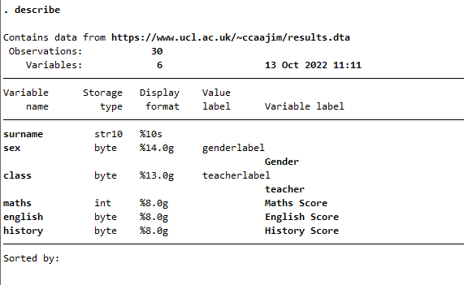

# Introduction

Data manipulation is the process of cleaning, organising and preparing data in a way that makes it suitable for analysis. Most real-world data sets require some form of manipulation to facilitate the downstream analysis and this process is often repeated a number of times during the data analysis cycle. In this series you will learn how to manipulate raw data and prepare it for analysis and then to carry out simple analysis of your data. The following topics are covered in the series:

-   ~~Learning to use multiple frames to work on data~~

-   ~~Merging data sets, with and without frames~~

-   ~~creating and dropping variables~~

-   ~~using `preserve` and `restore`~~

-   ~~creating subsets of data~~

-   ~~Reshaping data between long and wide form~~

There are \*\* sections to the tutorial, but each is quite short. There are few lengthy explanations. If you are not using this material in combination with a class, you will sometimes need to google for an explanation.

*Last Updated: `r format(Sys.time(), "%b %d, %Y %l:%M %p")`*

# Getting Started

## Prerequisites

These tutorials assume no knowledge of Stata but do assume that you are comfortable using a computer with a modern user interface (for example Windows, MacOs, linux with Ubuntu) and that you will be happy typing commands in a console or a script. You will also need to learn how to navigate a folder or directory tree.

## Software Requirements

Recent versions of Stata, 17 or later are required. You can check your version from the command line[^getting_started-1] with `version`.

[^getting_started-1]: See [Stata features page](https://www.stata.com/features/overview/graphical-user-interface/ "https://www.stata.com/features/overview/graphical-user-interface/").

## How to use these materials

Test all the code you see. Some of the code is written to be added to a script and you should develop a single script for all sections since some of the later material will assume that you have run earlier example code. Sometimes the tutorial suggests that you run a command on the console or command line and you should do so. Don't add commands intended for the console to your script - they may cause your script to break and fail.

Code to be executed and run by you looks like this:

    type this at the console and hit return
    or add it to a script and run the script

Generally the tutorial will be explicit about when you should add code to a script.

As the series progresses, I will provide less explicit detail in my instructions.  You will move from 

    type these characters and hit return
    
to

"The Stata command for a oneway anova is `oneway`.  Use this command to test the mean of `boodpressure` by `ethnicity`"

## Completion status

As of `r Sys.Date()` the final section of the tutorial on **regression** is not yet complete.

## Data

The data file to be used in most exercises and examples is to be loaded from

    https://www.ucl.ac.uk/~ccaajim/results
    
## Reference material

The best source of learning material is at

    https://stats.oarc.ucla.edu/stata/

and you should download the cheat sheets from

    https://www.stata.com/bookstore/stata-cheat-sheets/

## To be added

 - use of frames;
 - reshaping data sets.
 
# Some Stata basics

## Folders

I assume that you have a folder structure something like

    Project Folder
    ├── raw_data
    ├── scripts
    │   ├── cleanmydata.do
    │   └── modelmydata.do
    ├── documentation
    │   ├── PDFs
    │   └── Word_docs
    └──graphs

(though you probably don't have scripts named `cleanmydata.do` and `modelmydata.do`, those are just examples). Of course, other folder set-ups are possible, so be aware of your own as you follow the rest of this guide. The path to my main project folder,for example, is

`c:\users\jt\Documents\Projects\StataWrangling`

## Exercise

If you do not have a folder for your project (including for this training series project!), create one now with subfolders as above. You do not need to create the two do files in the scripts folder. You can do this in Stata. First type

    pwd

and then hit `enter`. Check the result and make sure that it shows the directory where you want to store your projects. To create the structure, you will find it easier right now using your computer's graphical user interface, but in case you want to do it in Stata, type the following Stata commands on the console (the command window), following each by return (replace ProjectName with a suitable name for your project)

    mkdir ProjectName
    cd ProjectName
    mkdir raw_data
    mkdir scripts
    mkdir documentation
    mkdir graphs
    cd documentation
    mkdir PDFs
    mkdir Word_docs
    cd ..
    pwd

Check that you end up back in your new project folder.

## Common File types

You will commonly encounter three types of file specific to Stata

-   The .dta file which is Stata's proprietary data format;
-   The .do file which is Stata's scripting file type;
-   The .log file which is the file type recording session logs.

# The do file

Do files are Stata's scripts. Simple programs made of text files of Stata commands.

Let's start off by creating a new do file, type

    doedit newdo.do

You can also create a new do file editing session from the **Window** menu in Stata.

Clear everything to make sure there's nothing leftover in our environment

    clear all

## Initialising your script

In a new data wrangling script you should

-   start a log;
-   make sure you are in the correct project directory;
-   clear working memory.

So to start this process, in your new do file add these lines:

    capture log close
    log using "MainProjectName $S_DATE.log", append

or

    capture cmdlog close
    cmdlog using "CommandsProjectName $S_DATE.log", append

to log commands only and not output.

## Exercise

Using your internet searching powers, find out why we wrote

    capture log close

at the start of the script, rather than just `log close`.

## Which directory?

Next you should make sure you are in the correct directory.

To check which directory you are currently in type

    pwd

on the Stata console.

## Change to your data directory

Change directory to the folder that will hold your project's raw data files (that is data that you have not processed or transformed). Normally for a data wrangling script, this will be the `raw_data` directory for the project and you change to that directory by typing a line like

    cd c:\users\jt\Documents\Projects\StataWrangling\raw_data\

(you must alter this to point at your folder). When you write code to read a raw data file, you will want to make sure that it is read into this directory.

## Exercise

Close the log file or log files you have created and outside of Stata find the files and view the content.

# Dataset

We're using a dataset of examination results from thirty school students.

These data are in Stata format. Each case or observation is a row with variables in columns[^basic_operations-1].

[^basic_operations-1]: Or almost, this data is in **wide** rather then **long** format, so it is not strictly tidy.

The data look something like this:

| surname   | sex | class | maths | english | history |
|:----------|----:|------:|------:|--------:|--------:|
| ADAMS     |   2 |     1 |    55 |      63 |      65 |
| ALI       |   2 |     1 |    52 |      46 |      35 |
| BAGAL     |   1 |     3 |    51 |      58 |      55 |
| BENJAMIN  |   1 |     2 |    59 |      70 |      68 |
| BLAKEMORE |   2 |     2 |    56 |      38 |      40 |

The Stata `use` command reads in data from Stata format files. Read the main data file by adding this command to your do file:

    use https://www.ucl.ac.uk/~ccaajim/results

When you first read a datafile, you should always

-   `describe` the data;
-   check the `codebook`.

You can do this for the complete set of variables for simple cases, but you may wish to be selective when you have a lot of variables.

## Data Types

The examination data is quite simple. In your do file add

    describe
    codebook

And run the do file. This first command produces



## Interpretation of `describe` output

This output shows first how many observations there are in your data and how many variables. The table that follows includes some detail about each variable:

### Storage type 

There are two basic data types in Stata: *numeric* and *string* data. String data has two subtypes: strL (L for long) variables can store phenominal amounts of character data (2 billion) and str# (where \# is a number) and have a limit on length of 2045 characters. Numeric data is of one of five types:

| type   | precision | range                            |
|:-------|:----------|:---------------------------------|
| byte   | integer   | -127 to 100                      |
| int    | integer   | -32,767 and 32,740               |
| long   | integer   | -2,147,483,647 and 2,147,483,620 |
| float  | real      | 8 digits of accuracy             |
| double | real      | 16 digits of accuracy            |

### Format types 

These are associated with variables - each has a default, which determines how values are displayed, so that regardless of the precision of the type, the number of decimal places and the width in number of characters to be displayed can be fixed. So a format type `%9.0g` is a left justified number of maximum 9 characters in width and with specific decimal precision (although in this case zero means 'just as many as can be displayed for this width').

## Interpretation of codebook

The output of `codebook` shows you the data type of the variables; the range and the numeric unit of measure; the number of unique values in the data; the number of values missing; the mean value for continuous variables; the standard deviation; the percentile values for the 10%, 25%, 50%, 75%, 90% points.

The value of output from `codebook` is enhanced if you have taken care to (#Labelling) [label] variables and values.

## Exercise

What are the types and formats of the variables `maths`, `english`, `history`? Why is `maths` different?

# Listing and Sorting

## Listing cases

To list data in the main results window you use the list command. If you type

    list maths english

on the console, Stata will respond by listing all observations for those variables. If you don't specify variables Stata use all the variables.

## Exercise

Type following line on the console

    list maths class in 1/6

How would you describe the effect of the modifier `in 1/6`

## Sorting

The most basic sort command in Stata is `sort`. This command sorts on a list of variables (at least one) in ascending order. Run this code in the command window

    sort sex maths

If you list the data now and scroll through the output, you will see it is sorted first by sex ascending and then by maths ascending. While useful, there is a more flexible command for sorting values.

## `gsort`

The command `gsort` also sortson on a list of variables, but you can determine the order by prefixing a variable name with + for ascending order or - for descending order. Try the following in the command window

    gsort +sex -class - maths

Again you should list and scroll and note effect.

# Detecting and correcting

In the data as you find it, there is an anomalous maths score. We can find this my simple inspection of the data because we have a small data set and few variables.

We could for example use `list` with an `if` condition, like this

    list surname maths if maths > 100 

which woulid list any cases with a `maths` value greater than the allowable maximum.

If we had a larger data set with many variables this would be much more difficult. We will write some code to help us in the detection of variables.

In Stata we can use programming functions that return values[^basic_operations-2]. Many functions return values **true** or **false**. There is a function **inrange(variable, min, max)** that returns true if *variable* is greater than *min* and less than or equal to *max*. We negate functions with the operator meaning **not**: **!**.

[^basic_operations-2]: See [Stata 17 Manual: Functions](https://www.stata.com/manuals/fn.pdf "Stata 17 Manual, Functions")

## Exercise

In your script add the following lines:

    gen anomaly = 0
    replace anomaly = 1 if !inrange(maths,0,100)

## Exercise

After you run the lines above, use `list` with `if` to determine if there are any anomalous cases in your data set. Have you detected any? How many?

The Stata symbol for or is **\|** sometimes called bar or pipe.

Alter the second line above so that it checks not only `maths` but the `english`, `history` and `avxm` variables as well.

## Replacing values

In the data for this tutorial, there is one score in `maths` that is clearly out of range. In this case we need to replace the `maths` score for the student with `surname` DENCIK. We can do that on the Stata command line with a replace command. For the sake of this exercise, snapshot the current state of your data with `preserve` and then type this command on the console:

    replace maths = 57 if surname == "DENCIK"

When you have inspected the data to ensure the correction has been made, `restore` the snapshot from before correction (This is to ensure that you can complete the next exercise. In a normal situtation you might preserve only at the end of your analysis or simply not save the results of changes you make to your data).

## Exercise

Correct the anomalous `maths` score, but do not base the replacement on the `surname` variable, rather use only the `maths` values.

# Generating new values and recoding existing values

## New values

There are two commands that generate new values in Stata: `generate` and `egen` (extended generate). The first is a very fast, basic Stata command and should be used whenever simple arithmetic or other manipulation of your data will create the new values, for example

    generate avxm = (maths + english + history)/3

The second is a more complicated command that can apply any of a list of pre-defined functions to your data. The same result as above for example can be created by

    egen avxm = rowmean(maths english history)

The full list of functions for `egen` is listed in Stata help.

Both commands can be used in conjunction with `replace` to achieve complex operations of generation and modification of variables, for example we may generate a new value and then conditionally make it missing for some cases:

generate avxm = (maths + english + history)/3

replace avxm = .a if avxm \< 40

## Exercise

Use either of `generate` to create a new variable `avxm` that is the mean of the three scores, `maths`, `english`, and `history`. Round the result to show no decimal places.(Read the Stata help on the `round()` function).

## Recoding values

It is not unusual to need to change the coding of a measure. For instance, we may have a continuous variable that we wish to recode into groups (giving a ranked variable that we will call `stream`). We can do this in a number of ways in Stata. I will use the most obvious, if verbose, method first.

Suppose that having calculated `avxm` as average examination score for each student, we now want to group the students according to their `avxm`. We will use the Stata `if` statement to do this.

When you undertake a more complicated data management task, it is very helpful to write out in pseudo-English what you want to do. So, I want to apply this rule to my data:

[     If avxm \>= 60, stream = "high",]{style="color: red;"}<br>         if avxm \< 60 & avxm \> 50, stream = "mid",<br>             if avxm \< 50, stream = "low"

I have purposefully written this out in the most explicity way. Now I'm going to reduce the complexity a little:

[     If avxm \>= 60, stream = "high",]{style="color: red;"}<br>         if avxm \< 50, stream = "low",<br>             else stream = "mid"

In this version I don't have to spell out the compound condition. Win!

Now, to write this in Stata, I will move the default 'else' condition to the top and use `gen` and `replace` with `if` to get my new variable:

    gen stream = 2 //the else or default condition
    replace stream = 3 if avxm >= 60 //cut off the top
    replace stream = 1 if avxm < 50 //cut off the bottom

I often prefer a numeric code to a string variable. Notice that I have used 3 for "high" against my own prejudice that it should be 1. In this way Stata and I will agree about ordering the data. I will explicitly label the data later to make it easier to read.

## Exercise

Examine the first ten cases in the data. Do they appear to be assigned to the correct `stream` according to the rule above?

Read [these instructions on using `cut`](https://stats.oarc.ucla.edu/stata/faq/how-can-i-recode-continuous-variables-into-groups/) and then use `cut` to create a new variable with the same distribution as `ranking` - give the variable any new name you like.

# Selecting

Selection of either variables or cases in Stata is often presented as applied to a single command or procedure. So, we use a list of variables after a command name and we may or may not then apply some criterion to filter the cases displayed. This works. It is however needlessly repetitive and sometimes we should consider

 - temporarily reducing the dataset in memory and operating over all data;
 - creating a **filter** variable to reduce complex selection expressions.
 
In what follows I mainly treat selecting data in the "traditional" way, but I will suggest that judicious use of `restore`and `preserve` as well as the practice of storing selection criteria in *filter variables* can improve your Stata experience.[^basic_operations-3]

[^basic_operations-3]: [How do I select a subset of observations using a complicated criterion?](https://www.stata.com/support/faqs/data-management/selecting-subset-of-observations/ "How do I select a subset of observations using a complicated criterion?")

## Selecting variables

We will use the command `list` which displays rows of variable values to illustrate the selection of variables.

With most commands, variables can be included in the *varlist* that follows a command name. So on the command line we can type

    list maths english history

which displays all the values for those three variables. Much of the time this is the only selection of variables you need.

But, there are times when you wish to select a subset of variables for manipulation perhaps for a series of operations. In this case we can use `preserve` and `restore`.

The command `preserve` takes a snapshot of a data set. If we then manipulate or modify the data, we can return to the snapshot state with the command `restore`. You can now use `drop varlist` to remove variables from the workplace or `keep varlist` to specify variables to be kept in the work space.

## Exercise

Use the `preserve` command to take a snapshot of your data and then drop the variables `surname` and `sex`. List the first ten observations in your data. Use `restore` to return to your original data. List the first ten observations in your data. Describe to your rubber duck[^basic_operations-4] the effect of `preserve` and `restore`.

[^basic_operations-4]: Your rubber duck may be an actual rubber duck and it may require some imagination to talk to your duck about Stata, but it will work! Alternatively, you may have a learning partner or study buddy and you can exploit them to listen to your explanation.

<!-- Stata has a built in *macro* (Stata speak for a script variable) named **\_all** that contains all the variable names currently in memory. -->

## Selecting cases

If you need to select cases, that is rows from your data, you should use the `if` operator in your command. We will use `list` again to illustrate. Type the following on the console

     list surname english maths if english > 60 & maths < 50

We can add wildcards to our selection criteria using regular expressions. To do this we use Stata's **regexm()** function. The following example illustrates the use of **regexm()**in a compound condition on `list` [^basic_operations-5] .

```
list surname english maths if !regexm(surname,"\^B") & english \> 60 & maths \< 60
```

[^basic_operations-5]: [What are regular expressions and how can I use them in Stata?](https://www.stata.com/support/faqs/data-management/regular-expressions/ "What are regular expressions and how can I use them in Stata?")

## Using a filter variable

A filter variable is a variable created to indicate membership of a sub-group of your data. Using the `generate` command with `if` conditions you can reduce a complex selection operation to a simpler expression. For example, suppose that you wish to select cases where

-   class is three;
-   maths is less than 55;
-   history is greater 55.

If we first try with a list command we will write

    list if class == 3 & maths < 55 & history > 55

You should find that this lists just three cases. If we want to continually operate over just these cases for some part of our analysis then rather than writing this complex expression each time, we can generate a variable to act as a filter

    generate filtervar = 1 if class === 3 & maths < 55 & history > 55

and now the selection condition for further operations is reduced to

    if filtervar == 1

This method requires some discipline to remove filter variables (with `drop`) when their work is done.

## The uses of \_all

Stata has a built in *macro* (Stata speak for a script variable) named **\_all** that contains all the variable names currently in memory.

The `_all` macro is obviously useful. but, it can be more useful combined with `drop` and `keep`. The command `drop varlist` removes variables from the workspace, while `keep varlist` drops all but the named variables.

So, if we want to produce summary statistics for all continuous variables in our data, we can use `keep` followed by the list of names and then calculate the summaries for `_all`.

## Exercise

Add the following lines to your script

        preserve
        keep maths english history
        summarize _all
        restore

What is the effect of these lines?

How many variables are in working memory after the `keep` command? How many variables are in working memory after the `restore` command?

Add the following lines to your script

    preserve
    keep maths english history
    tabstat _all, statistics(mean sd var kurt skew)
    restore

Answer these questions:

1.  What is the Skewness of the **mathematics** scores?
2.  Which scores show more variability, **English** or **History**?
3.  Which subject has the lowest mean score?

## Creating a custom variable list

Since many commands take a list of variables to operate on, it can be useful to create a specific list of variables that you can easily refer to repeatedly. We will do this with a Stata macro. Stata macros are programming variables or, if you prefer, containers for text. Stata has both local and global macros and for the most part you will use local macros in your scripts.

Add the following lines to your script

    local conts maths english history
    summarize `conts'

Since in this case we don't drop any variables, we don't need to use `preserve` and `restore` to work on a subset of our data unless we otherwise transform any values.

# Labelling

## Variables

Variable names are not always very human friendly. It is useful therefor to be able to attach a **label** to a variable, especially for use in output such as graphs.

Add the following line of code to your script

    label variable sex "Gender"

now use the `table` command to view a table of frequencies of the `sex` variable. What has been the effect of your line of code?

## Exercise

Create appropriate labels for the variables in your data set.

## Values

When we code some categorical variables, we will often use a *code* to represent the different possible values. for example, we might code eyecolour as

| Code | Meaning |
|:-----|:--------|
| 1    | Brown   |
| 2    | Blue    |
| 3    | Grey    |
| 4    | Green   |
| 5    | Other   |

The use of numeric codes is very convenient in many circumstances, but it is not very human friendly. We would also like to put more meaningful labels for the values on output such as tables and graphs. To do this we create a **label set** and apply it to the variable values.

The label set is a list of codes and meanings create by a command like

    label define eyecolourlabels 1 "Brown" 2 "Blue" 3 "Grey" 4 "Green" 5 "Other"

We apply the labels to values of a variable `eyecolour` with a command like

    label values eyecolour eyecolourlabels

## Exercise

Create an appropriate label set for the variable `sex` in your data set and apply it to the values of `sex`. Use the `list` command to check the results. What do you see?

# Some exploratory analysis

Before embarking on the systematic modelling and testing of data, you may wish to explore its broad outline. There are several useful Stata procedures for this task:

-   simple visualisatons:

    -   box plots;
    -   histograms;
    -   bar charts;

-   summary statistics;

-   tables.

## Simple visualisations

For continuous numeric data you can create box plots and histograms. In your do file add the line

    hist maths

You might like to create graphs for a list of variables. You can try to first create a macro containing the variable names, then create the histograms. As in the following lines

    local conts maths english history
    hist `conts'

Unfortunately, this does not work (since `hist` can only be followed by a single variable) and in any case soon as Stata creates a new graph, the currently open graph window is destroyed. We can avoid this by creating and exporting the histograms we create in a program [^basic_operations-6].

[^basic_operations-6]: [Loop tutorial from Data Carpentry](https://datacarpentry.org/stata-economics/06-loops/ "Loop tutorial from Data Carpentry")

Add the following lines to your script

    foreach var in `conts' {
        hist `var'
        graph export `var'.png
    }

Once this loop terminates, you can look in your current directory to find the exported graphs.

You can dig deeper into your data by grouping values by any factor (categorical) variables, for example

    graph box `conts', by(sex)

## Exercise

Create histograms for the `english` and`history` data. How similar or dissimilar do you think these data are?

Create box plots of `maths` for each level of`sex`. How do you think the male and female maths scores compare?

Using your web searching powers, see if you can generate a box plot of maths scores that is subset by both `sex` and `class`.  You should look out for mention of an option `over'.

Having created the box plot by `sex` above, open Stata's graph editor and add the title to the plot "Maths scores by gender".

## Summary statistics

Quick summary statistics for continuous numeric variables can be calculated with the `summarize` command. Try the command

    summarize maths

You will see that this gives a brief summary of the variable.

you can add detail to the summary with the `detail` option

    summarize maths english, detail

Summary statistics for continuous numeric variables can also be created with the `tabstat` command.

    tabstat maths english

and you can specify statistics with the `statistic` option:

    tabstat maths english, statistic(median var skew)

A Stata command that calculates statistics will display some default output. You can check what is displayed in `help`. However, many routines actually compute more statistics than are displayed. These quantities are stored in the *return list* for the command and can be accessed after it runs. For descriptive statistics, the list is called **r()**. The brackets indicate that **r()** is an array and that we can select particular statistics from the list. Consider

    summarize maths

The default output looks like

        Variable |        Obs        Mean    Std. dev.       Min        Max
    -------------+---------------------------------------------------------
           maths |         30    53.76667    6.295501         39         64

If we now use the command `return list` we see

    scalars:
                      r(N) =  30
                  r(sum_w) =  30
                   r(mean) =  53.76666666666667
                    r(Var) =  39.63333333333333
                     r(sd) =  6.295501039101918
                    r(min) =  39
                    r(max) =  64
                    r(sum) =  1613

These further can be viewed individually using, for example,

    di r(Var)

and in more advanced procedures you can use them in **collections** and in mathematical expressions.

## Exercise

Compute the summary statistics with detail for `history`. Use the return list from the command and then display the kurtosis of the variable.

## Tables

As well as tables of statistics for continuous data calculated with `tabstat`, you can create tables of frequencies for categorical data. For example

    table sex

You can add percentages and cumulative percentages by using `tab` (short for `tabulate`) instead of table

    tab sex

These commands create one-way tables of frequencies. A two-way table can be created by adding a variable

    tab sex class
    tabulate sex class

You will see that the difference in output here is cosmetic.

The syntax of table is actually

    table (rowvariables) (columnvariables)

where the parentheses are only required if you have more than one variable in row or column.

## Tables with custom statistics

It is possible to create tables that show expected as well as observed frequency values

    table sex class, expected

and to add specific detail about a continuous variable by using the **command()** option[^basic_operations-7]. For example:

    table (class) (sex),command(r(sd) r(skewness): summarize maths, detail)

You will notice that the `command` option uses values from the **return list** for (in this example) the `summarize` command.

[^basic_operations-7]: [See the Stata manual for the command option](https://www.stata.com/manuals/rtable.pdf "See the Stata manual for the command option").

# Hypothesis tests

## For two categorical variables

A common procedure is to test for an association between two categorical variables. We can illustrate this procedure using a tabulation with a $\chi{}^2$ statistic.

    table sex class, expected chi2

## Exercise

Create the table with $\chi{}^2$ statistic and expected values as above. Should you reject the *H0* that `sex` and `class` are not associated?

## For one continuous and one categorical variable of two levels

If we have one continuous numeric variable and one two level categorical variable (such as sex) that would divide our data into two groups, we can ask ourselves whether the mean of the continuous variable differs for the groups (with *H0* being that they do not).

If our two groups are independent, then we must first ask if the **variance** in the data is more or less equal between groups. The null hypothesis is that the variances are equal. This is tested by the comparison of variances using Stata's `robvar` command. We can test the `maths` scores by `sex` in our data

    robvar maths, by(sex)

Knowing whether or not we are dealing with groups displaying (more or less) equal variance in the variable of interest, we can go on to conduct an **independent samples t-test**. The code is

    ttest maths, by(sex)

(Assuming that we have interpreted the results of `robvar` to mean the variance in maths for the two groups is equal).

## Exercise

Run the `robvar` procedure above but for the `history` and `sex` variables. What are the three **W** statistics produced? Which of them tests that the variances are equal for a comparison of means? Is there strong enough evidence in this case to reject the null hypothesis?

Use the `ttest` command to test the null hypothesis that

$$\mu{}\ english _{\ female \ students} = \mu \ english _{\ male\ students}$$

What conclusion do you draw?

## The paired samples ttest

We can also compare the same group of subjects on two measures to see if the means differ. In this case there is no need to check the variances before conducting the test. For example we could test whether or not mean scores in English and History differ (with the null hypothesis that they do not)

    ttest english == history

Using this procedure, how do English scores compare to History scores and how do English scores compare to Mathematics scores?

## Once continuous and one categorical variable of more than two levels

We can compare the level `avxm` by `teacher`, this is to say test the null hypothesis

$$\mu{}\ avxm \ _{teacher \ one} =  \mu{}\ avxm \ _{teacher \ two} = \mu{}\ avxm \ _{teacher \ three} $$

### One way ANOVA and post-hoc testing

The Stata command to test the null hypothesis above is

    oneway maths teacher, bonferroni tabulate

This command produces summary statistics the ANOVA statistic **F**, its associated probability, and other quantities calculated as part of the ANOVA. In the version given above, we have included a tabulation of pairwise comparisons using the *bonferroni* correction. We can separately examine the pairwise comparisons if we wish with

    pwmean avxm, over(teacher) mcompare(bonferroni) effects

This method does not display the ANOVA table itself and the **mcompare()** option gives us access to a slightly different range of correction options.

<!-- ## Visualisation for AVOVA -->

<!-- library("ggpubr") -->

<!-- ggboxplot(my_data, x = "group", y = "weight",  -->

<!--           color = "group", palette = c("#00AFBB", "#E7B800", "#FC4E07"), -->

<!--           order = c("ctrl", "trt1", "trt2"), -->

<!--           ylab = "Weight", xlab = "Treatment") -->

## Two continuous variables

## Correlation

Analysis of two continuous variables begins with calculating the **Pearson Correlation Coefficient R**. This statistic ranges from

-   -1 indicating an inverse or negative correlation
-   0 indicating no correlation
-   +1 indicating a positive correlation

We should take note that a correlation has not only magnitude and direction, but that there is an associated hypothesis test: the the true correlation is 0. This test gives a **p value** associated with **R**.

The code to compute R in Stata is

    correlate var1 var2

This computes R for `var1` and `var2`. If you do not specify a variable list, Stata computes correlations between all non-string variables in your data set.

## Exercise

Compute Pearson correlations with significance values for the pairs

-   english-maths
-   english-history

Explain to your learning partner what the results mean to you.

### Simple visualisation of correlation

The simplest way to visualise a correlation is with a scatter plot. You may wish to consider, based on your plans for further analysis which variable you wish to assign to which axis. To create a scatter plot you can start with

    scatter english history

To add the trend line:

    scatter english history || lfit english history

And add a confidence interval:

    scatter english history || lfitci english history

Now you can add labels, titles and so on

    twoway lfitci english history  || scatter english history, jitter(5) ///
      title("English as a predictor of History scores") ///
        legend(off) ///
        mcolor(red) ///
        msymbol(Oh) ///
        subtitle("For all students") ///
        xtitle("English exam scores") ///
        ytitle("History exam scores") ///
        scheme(sj)

Stata has a very large range of graphing commands and options. While they are reasonably complicated, a good way to explore them is through [this gallery](https://www.stata.com/support/faqs/graphics/gph/stata-graphs/ "Stata graph gallery").

## Exercise

Using any resources you can find, try to find more Stata graph schemes and try at least three on the code above.

# Regression

## Simple Linear Regression

The most basic regression command in Stata is `regress`. The syntax is

    regress y-variable x-variable(s)[, options]

The results include an ANOVA table and a table of coefficients. The ANOVA table has measures associated with the $H0$ that this model is no better than a model with no predictor variables. You should read [Regression analysis, annotated output](https://stats.oarc.ucla.edu/stata/output/regression-analysis) for help understanding the results.

The important components of the coefficient table are

-   \_cons: the intercept
-   beta coefficient ($m$) and it's associated $t$ score with $p$ value and confidence interval.

## Exercise

Run a simple linear regression with `history` as the dependent variable (the *y* variable) and `english` as the single, independent variable (the *x* variable).

-   Is this model better than a model with **no** predictor variables?
-   Fill out the coefficients in the equation for the line $y=mx+\beta{}$;\
-   Overall, what portion of the variance in `history` can be attributed to variance in `english`;
-   Is it plausible that the true value of $m$ (the slope of the line of best fit) is 0?

## Multiple linear regression

The command is

    regress y-variable x-variable1 x-variable2...x-variablen [,options]

## Exercise

Using California Department of Education's API 2000 dataset from

    https://stats.idre.ucla.edu/stat/stata/webbooks/reg/elemapi

investigate the academic performance of schools (api00) with respect to average k3 class size, the percentage of students receiving free meals and the percentage of teachers holding full teaching credentials. Would you say that any or all of these factors affect a schools performance?

## Regression with categorical variables

It is possible to include categorical variables in a regression model. For instance

    regress avxm i.class

The prefix *i.* signals to Stata this this variable should be treated as a factor. Stata will effectively recode this as two dummy, binary variables class_2 and class_3. So the possibilities are

| Class_2 | Class_3 | Original class |
|:-------:|:-------:|:--------------:|
|    1    |    0    |       2        |
|    0    |    1    |       3        |
|    0    |    0    |       1        |

: Dummy encoding of the class variable

If we recall equation for the linear model $y = mx_{1} + mx_{2}...+...mx_n$, then we can see it applies unchanged for this new regression, except that for each coefficient, $x$ ranges over only 0 or 1.

Here is the result from Stata:


Here, the intercept (`_cons`) is the average of the dependent variable - of `avxm` - when class is equal to the base category, which in this case is class one. For class two, the value of y is

$$(3.59*1)+(6.64*0)+52.46$$
and for class three

$$(3.59*0)+(6.64*1)+52.46$$
To further underline the nature of a regression with categorical independent variables, you can compare the results of this regression with the output form Stata's `oneway` and `pwmean` commands.  You will see that the differences in means and the statistics and associated $p$ value .

## Exercise

Run a one way ANOVA test comparing `avxm` by level of `class`.  Add the post hoc pairwise tests with Bonferroni correction.  

Run a `pwmean` procedure for `avxm` over `class`.  

How would you say the results from these compare with the regression above?

# Notes
